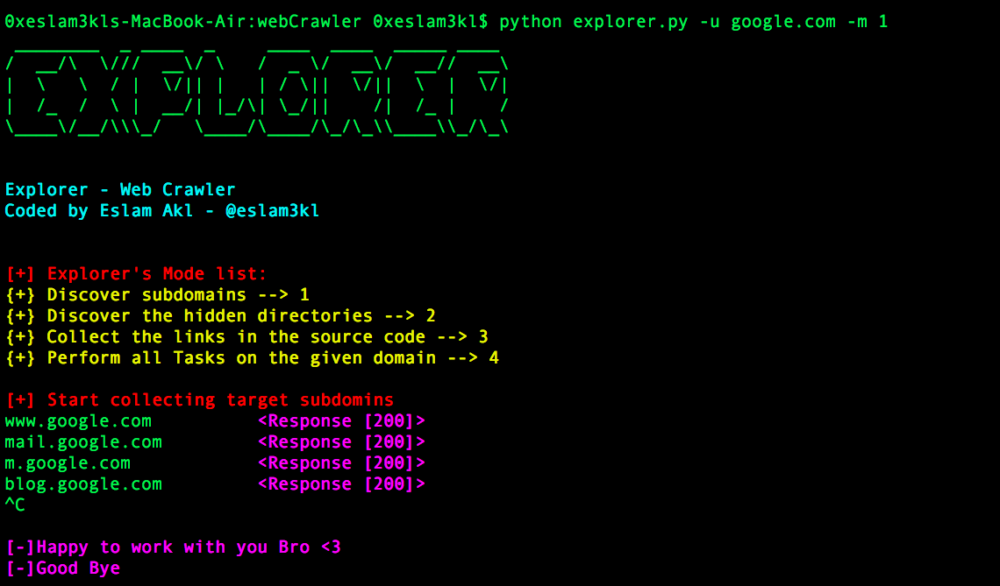
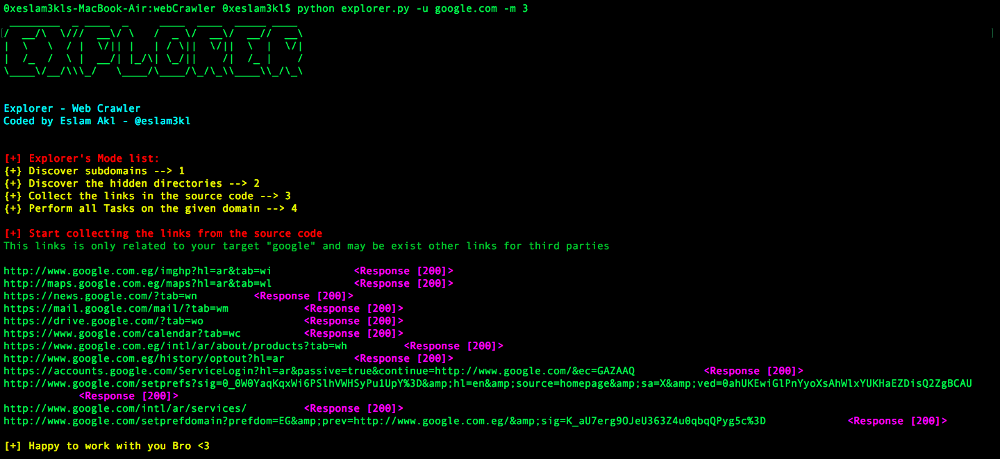

# Explorer
Explorer is a very useful tool which will help you at the Recon phase in Bug Bounty hunting or Web Pentesting. It can perform a lot of things individually or all together. 

### By using Explorer you can perfom this pahses one by one or perform all together: 

#### 1. Discover the LIVE subdomains related to the target by brute-forcing almost 10000 subdomain in less time. 

#### 2. Collect all the links which is in the source code of a particular domain, this links may be lead to JS files 

#### 3. Discover the Public & Hidden Direcoties which may be have sensetive information related to the target like source code or credentials info 

#### All of the result will get with the response code 2xx or 3xx 

----------------------------------------------------

### Install: 

`pip install -r requirements.txt`

----------------------------------------------------

### Usage 

`python explorer.py -u example.com -m mode_number`

parameter |  Usage
------------ | -------------
-u = --url | The target URL (Without https or http)
-m = --mode | Enumeration Mode 1(Collect subdomains), 2(Discover Hidden Directories), 3(Enumerate links) or 4(Perform all tasks) 

